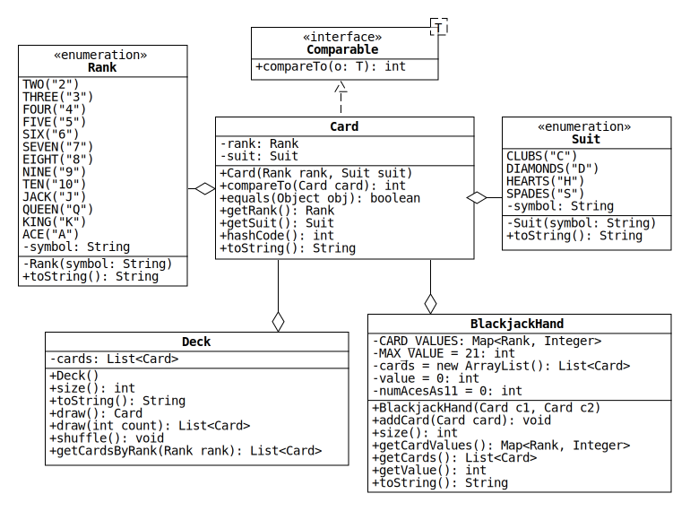

# Lab 9: Collections of Cards

In this lab, we will use the [Java collections framework](https://docs.oracle.com/en/java/javase/11/docs/api/java.base/java/util/doc-files/coll-overview.html) to write classes that represent collections of playing cards from a [standard 52-card deck](https://en.wikipedia.org/wiki/Standard_52-card_deck).
Additionally, we will use enumeration types to represent the ranks and suits of the cards.
Below is a UML diagram with the details.

Before starting this assignment, you may want to review the following material:

* zyBook: 15.3, 15.5, and 15.6
* Oracle Java Tutorial: [Enum Types](https://docs.oracle.com/javase/tutorial/java/javaOO/enum.html)

## Rank and Suit

Rank and Suit are [enumeration types](https://docs.oracle.com/en/java/javase/11/docs/api/java.base/java/lang/Enum.html) that represent the ranks and suits of a standard deck of playing cards.

* `toString()`: Return the string representation of the enum constant, which is assigned to the symbol field.

## Card

Card represents the cards in a standard deck.
Each Card object has a Rank and a Suit.

* `Card(Rank rank, Suit suit)`: Assign the given enum constants to the fields.
If either reference is null, throw a NullPointerException.

* `compareTo()`: Implement the method so that a list of Cards is sorted first by Suit and then by Rank.
(Hint: Java enums implement the [Comparable](https://docs.oracle.com/en/java/javase/11/docs/api/java.base/java/lang/Comparable.html) interface, and the compiler automatically generates their [compareTo](https://docs.oracle.com/en/java/javase/11/docs/api/java.base/java/lang/Enum.html#compareTo(E)) method.)

* `equals(Object obj)`: Override the Object equals method so that two Cards are considered equal if they have the same Rank and Suit.
Do this by following these steps:

  1. Check if the given object is an instance of Card. If not, return false.
  2. [Downcast](https://en.wikipedia.org/wiki/Downcasting) the Object reference to Card.
  3. Compare the Ranks and Suits of the Cards.

* `hashCode()`: Any class that overrides equals [should also override hashCode](https://docs.oracle.com/javase/tutorial/java/IandI/objectclass.html).
Do this using a method of the [Objects](https://docs.oracle.com/en/java/javase/11/docs/api/java.base/java/util/Objects.html) class as shown in the JUnit tests.

* `toString()`: Return the concatenation of the string representations of the Rank and Suit.

## Deck

Deck represents a standard deck of playing cards.
Each Deck object has a [List](https://docs.oracle.com/en/java/javase/11/docs/api/java.base/java/util/List.html) of Cards.

* `Deck()`: Initialize the List so that it contains all 52 unique Cards in sorted order.
(Hint: Use the enum `values()` method, which is automatically added to Rank and Suit by the compiler.)

* `draw()`: Remove and return the first Card in the List.
If the List is empty, return null.

* `draw(int count)`: Remove and return the given number of Cards from the front of the List.
If the number is larger than the size, remove and return all the Cards.
If the number is less than zero, return an empty List.

* `shuffle()`: Randomize the order of the Cards in the List.
(Hint: Use a method of the [Collections](https://docs.oracle.com/en/java/javase/11/docs/api/java.base/java/util/Collections.html) class.)

* `size()`: Return the number of Cards in the List.

* `toString()`: Return the string representation of the List. (Hint: List implementations include a `toString()` method that returns a 
string representation of the list.)

* `getCardsByRank(Rank rank)`: Return the list of cards in the deck, with the corresponding argument rank.  

## BlackjackHand

BlackjackHand represents a hand of cards in a game of [Blackjack](https://en.wikipedia.org/wiki/Blackjack).
Objects of the class are created with two Cards that are stored in a List.
More Cards can be added until the value of the hand reaches 21 or greater.

* `CARD_VALUES`: A static [Map](https://docs.oracle.com/en/java/javase/11/docs/api/java.base/java/util/Map.html) from card ranks to card values.
Cards with a numerical rank have the same value as the number; jacks, queens, and kings have a value of 10.
Aces have a value of either 1 or 11, but a Map can only store one value with each key, so store the larger value.

  To initialize a static field like this that requires multiple lines of code, create the Map in a [static initialization block](https://docs.oracle.com/javase/tutorial/java/javaOO/initial.html).

* `addCard(Card card)`: First, check if the card is null, throw a `NullPointerException`. If the current value of the hand is less than MAX_VALUE, add the given Card to the end of the List. Make sure you update `numAcesAs11` 
  if the card rank is Ace. Also, you must update the `value` field whenever you add a card.

* `getCardValues()`: Return a copy of the card values Map.

* `getCards()`: Return a copy of the cards List.

* `getValue()`: Return the value of the hand (i.e., the total value of all the Cards).
While the value is greater than MAX_VALUE and the hand contains aces, choose the smaller value (i.e., 1) for Aces to minimize the total value.

* `size()`: Return the number of Cards in the List.

* `toString()`: Return the string representation of the List.
